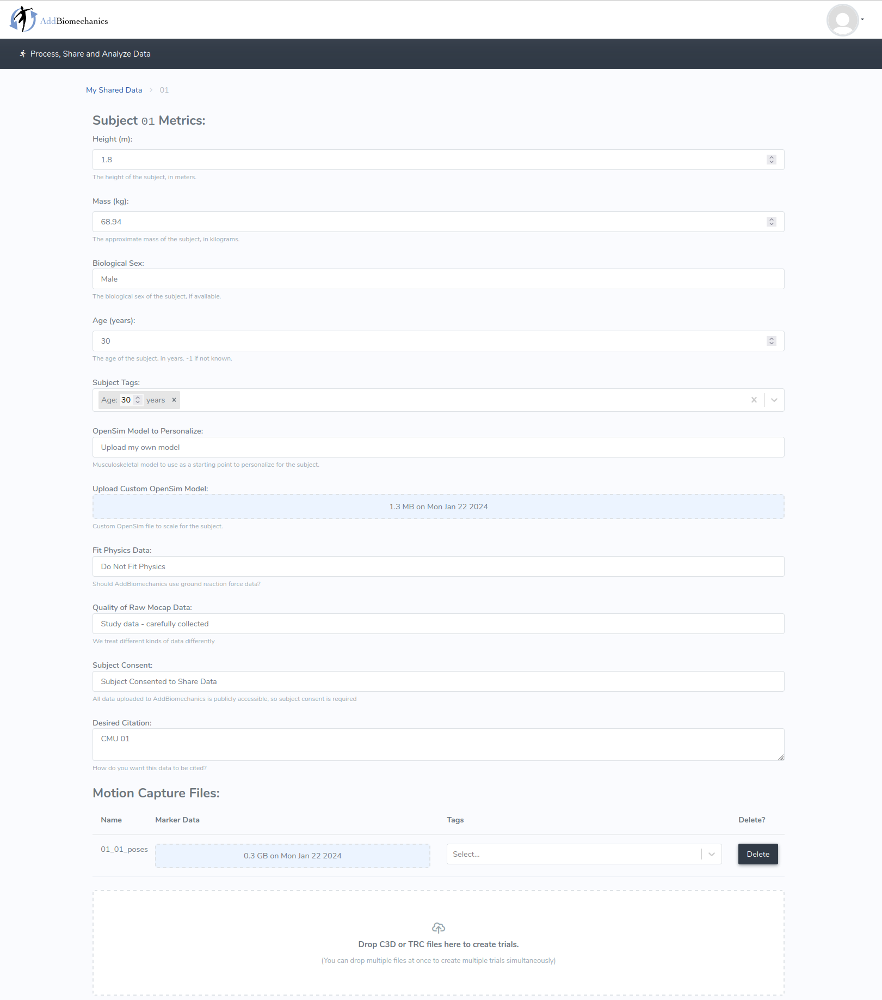
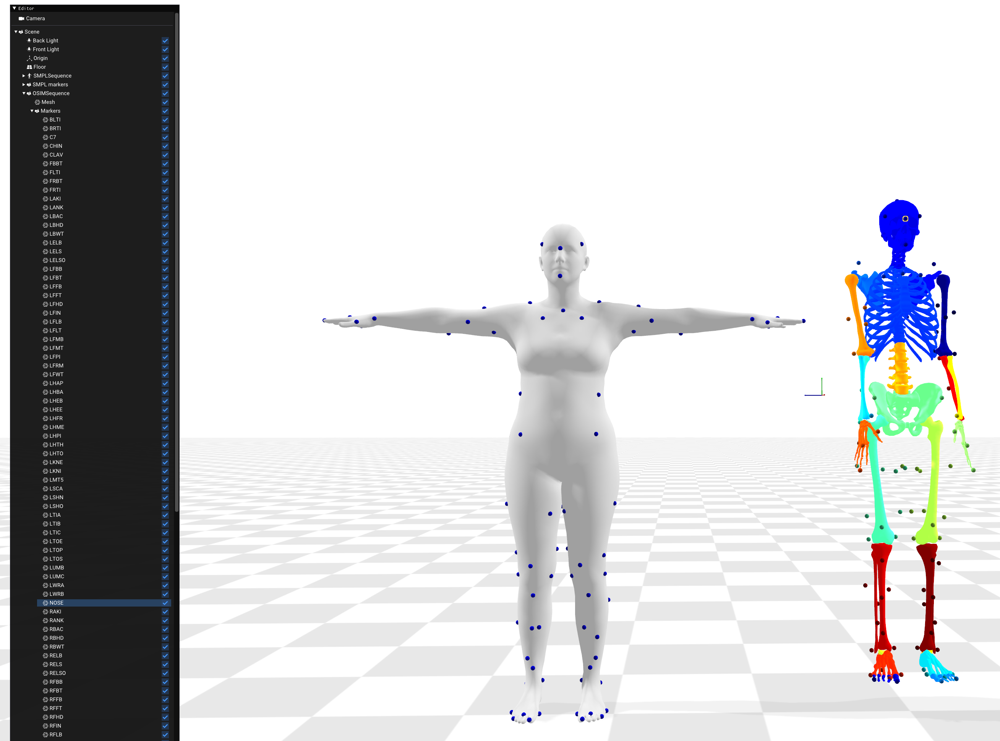

# SMPL to AddBiomechanics

This repository is part of the code release for the Siggraph Asia 2023 paper "From Skin to Skeleton: Towards Biomechanically Accurate 3D Digital Humans". 

[[paper](https://download.is.tue.mpg.de/skel/main_paper.pdf)] [[project page](https://skel.is.tue.mpg.de/)]


Given a [SMPL](https://smpl.is.tue.mpg.de/) body motion sequence as .npz or .pkl we enable getting  a scaled [OpenSim](https://simtk.org/projects/opensim) skeleton model (.osim) and the corresponding skeleton motion (.mot).


https://github.com/MarilynKeller/SMPL2AddBiomechanics/assets/102662583/95130620-4f62-4c41-a79a-dae3228d6951

*Left: Input SMPL sequence   Right: Output OpenSim sequence*

-----------


We provide here code for fitting an OpenSim skeleton model from SMPL sequences using AddBiomechanics. [AddBiomechanics](https://addbiomechanics.org/) is a free online tool designed to align an OpenSim skeleton model to motion capture data.

If you are loooking for the SKEL model code, please check the [SKEL repository](https://github.com/MarilynKeller/SKEL).

## Table of Contents 

- [Installation](#installation)
  - [SMPL](#smpl)
  - [BSM](#bsm)
  - [OSSO (Optional)](#osso-optional)
- [Usage](#usage)
  - [Quick start](#quick-start)
  - [Custom markers](#custom-markers)
  - [Running AddBiomechanics locally](#running-addbiomechanics-locally)
- [Running the code on your own data](#running-the-code-on-your-own-data)
  - [SMPL sequences](#smpl-sequences)
  - [Biomechanical model](#biomechanical-model)
  - [Markers on SMPL](#markers-on-smpl)
  - [Using SMPL X](#using-smpl-x)
- [Citation](#citation)
- [License](#license)
- [Contact](#contact)

## Installation

This repo was tested with python3.8

First, install the dependencies and the package with the following line:
```pip install -e .```


### SMPL

Download the file: SMPL_python_v.1.1.0.zip from the [SMPL download page](https://smpl.is.tue.mpg.de/). And run:

```
cd ../SMPL2AddBiomechanics
python scripts/setup_smpl.py /path/to/SMPL_python_v.1.1.0.zip  
```

If you plan to use SMPL-X files rather than SMPL+H ones, also download the file: smplx_lockedhead_20230207.zip from the [SMPL-X download page](https://smpl-x.is.tue.mpg.de/). And run:

```
cd ../SMPL2AddBiomechanics
python scripts/setup_smplx.py /path/to/smplx_lockedhead_20230207.zip  
```


### BSM 

Download the file: skel_models_v1.x.zip from the [SKEL download page](https://skel.is.tue.mpg.de/). And run:

```
cd ../SMPL2AddBiomechanics
python scripts/setup_bsm.py /path/to/skel_models_v1.1.zip
```


### OSSO (Optional)
To generate a personalized custom marker set on the BSM model, you will need [OSSO](https://github.com/MarilynKeller/OSSO/). Please check the [OSSO installation instructions](https://github.com/MarilynKeller/OSSO/blob/main/installation.md) to set it up.


## Usage

### Quick start

Below is an example that takes the SMPL motion `models/bsm/sample_motion/01_01_poses.npz` and generates measurements and synthetic motion capture data from the sequence.

```bash
python smpl2ab/smpl2addbio.py -i  models/bsm/sample_motion/01 
``` 

This generates an output folder containing the following files:
```
output
└── 01
    ├── _subject.json
    └── trials
        └── 01_01_poses.trc
```

The `_subject.json` file contains the estimated subject measurements :
`{"sex": "male", "massKg": "68.94", "heightM": "1.80"}`
, and the `trc` file contains the synthetic motion capture data for the input sequences.

This information can be used as input for [AddBiomechanics](https://addbiomechanics.org/) to align the OpenSim model to the motion capture data.

In the 'Upload Custom OpenSim Model' section, upload the BSM model `models/bsm/bsm.osim`.

In the "Motion Capture Files" section, upload the `trc` file from `output/01/trials/01_01_poses.trc`.

Below is shown the form filled with the data from the example above:

[](assets/add_bio_form.png)

Then click on "Process" and wait for the optimization to finish. You will then be able to download the optimized model.

Once the process done, you can download the results (in this case 01.zip), extract the zip file and run the following command to visualize the results:

```bash
 python smpl2ab/show_ab_results.py --osim_path=addbio_res_folder/01/Models/match_markers_but_ignore_physics.osim --mot_path=addbio_res_folder/01/IK/01_01_poses_segment_0_ik.mot --smpl_motion_path=models/bsm/sample_motion/01/01_01_poses.npz
```

This script shows the superimposition of the input SMPL sequences, the markers that were created in green, and the OpenSim skeleton aligned by AddBiomechanics.

https://github.com/MarilynKeller/SMPL2AddBiomechanics/assets/102662583/0995bd48-8ef7-4ed8-aaad-b92199f6ae3e


### Custom markers

The marker locations wrt the bones depend on the body shape. While AddBiomechanics does optimize the location of the marker, we propose a method that leverages OSSO to generate personalized custom markers set on the OpenSim model. 
To use this option, add the '--osso' flag to the command line. This will generate a `bsm.osim` file in the output folder that contains a version of the BSM model with personalized markers. 

```bash 
python smpl2ab/smpl2addbio.py -i  models/bsm/sample_motion/01 --osso --display
```

Then proceed as above to upload the data to [AddBiomechanics](https://dev-addbiomechanics.org/). But this time, upload the `bsm.osim` file from `output/01/bsm.osim` in the "Upload Custom OpenSim Model" section.

Note that this option only works with the BSM model. If you want to use your own OpenSim model, you will need to manually add the markers on the model.

### Running AddBiomechanics locally

If you want to run AddBiomechanics locally, you can download and install the source code from the [AddBiomechanics GitHub page](https://github.com/keenon/AddBiomechanics).

The script [AddBiomechanics/blob/main/server/engine/src/engine.py](https://github.com/keenon/AddBiomechanics/blob/main/server/engine/src/engine.py) runs the optimization given a folder of data.

## Running the code on your own data

You will need
- A SMPL motion sequence
- A biomechanical skeleton model .osim with markers defined on it (BSM will be used by default)
- A dictionary giving, for each marker of the .osim, the corresponding vertex index on SMPL (The BSM correspondence will be used by default)

Below, we detail those items in more depth.

### SMPL sequences
You can download SMPL sequences from the [AMASS](https://amass.is.tue.mpg.de/) download page, by clicking the `SMPL+H` button. 
Here we show an example for the subject `10` of `CMU`. The AMASS data consists in a folder with this structure:
```
CMU
└── 10
    ├── 10_01_poses.npz
    ├── 10_02_poses.npz
    ├── 10_03_poses.npz
    ├── 10_04_poses.npz
    └── 10_05_poses.npz
```

Each .npz is a sequence.

You should pass the path to the subject folder (in this example `/path/to/CMU/10`) to the `smpl2addbio.py` script.


### Biomechanical model

This is an OpenSim model with markers defined on it, in .osim format. By default, the downloaded BSM model will be used.
You can also use your OpenSim model:
  
  ```bash
python smpl2ab/smpl2addbio.py -i  models/bsm/sample_motion/01 --osim /path/to/your_model.osim --marker_dict /path/to/smpl_markers_dict.yaml
```

Note that in this case, you will need to provide a dictionary giving, for each marker of the .osim model, the corresponding vertex index on SMPL, see the next section for more detail.

### Markers on SMPL

To fit the OpenSim model to the SMPL sequence, we need to have the same markers defined on both models. So for each marker of the .osim model, you need to provide the corresponding vertex index on SMPL.
By default, we use the BSM marker set. You can find it as a dictionary in `SMPL2AddBiomechanics/smpl2ab/data/bsm_markers.yaml`.

If your model has a different marker set, you can create your own dictionary similar `SMPL2AddBiomechanics/smpl2ab/data/bsm_markers.yaml`.
This dictionary must contain the same markers as your .osim model. To help you to create this dictionnary, you can run the following script:
```bash
python smpl2ab/utils/kin_helpers.py -o  /path/to/your/model.osim  -m -mr
```

You can check visually that the SMPL markers defined in the dictionary match the OpenSim model markers by running:
```bash
python smpl2ab/show_markers.py --osim_path /path/to/your/model.osim --smpl_markers_path /path/to/smpl_markers_dict.yaml
```

[](assets/markers_vizu.png)

### Using SMPL X

All the demo script can be run on SMPLX sequences by adding the argument `--body_model=smplx`. In this case you will need to specify a SMPLX specific marker set  `--marker_set_path smpl2ab/data/bsm_markers_smplx.yaml ` since the vertices indices are different for SMPL and SMPLX.
Thanks to David Pagnon for this contribution.

## Citation
If you use this software, please cite the following work and software:

```
@inproceedings{keller2023skel,
  title = {From Skin to Skeleton: Towards Biomechanically Accurate 3D Digital Humans},
  author = {Keller, Marilyn and Werling, Keenon and Shin, Soyong and Delp, Scott and 
            Pujades, Sergi and Liu, C. Karen and Black, Michael J.},
  booktitle = {ACM ToG, Proc.~SIGGRAPH Asia},
  volume = {42},
  number = {6},
  month = dec,
  year = {2023},
}
```

## License

This code and model are available for non-commercial scientific research purposes as defined in the [LICENSE.txt](LICENSE.txt) file.


## Contact 

For any questions about BSM and SKEL, please contact skel@tuebingen.mpg.de.

For commercial licensing, please contact ps-licensing@tue.mpg.de
